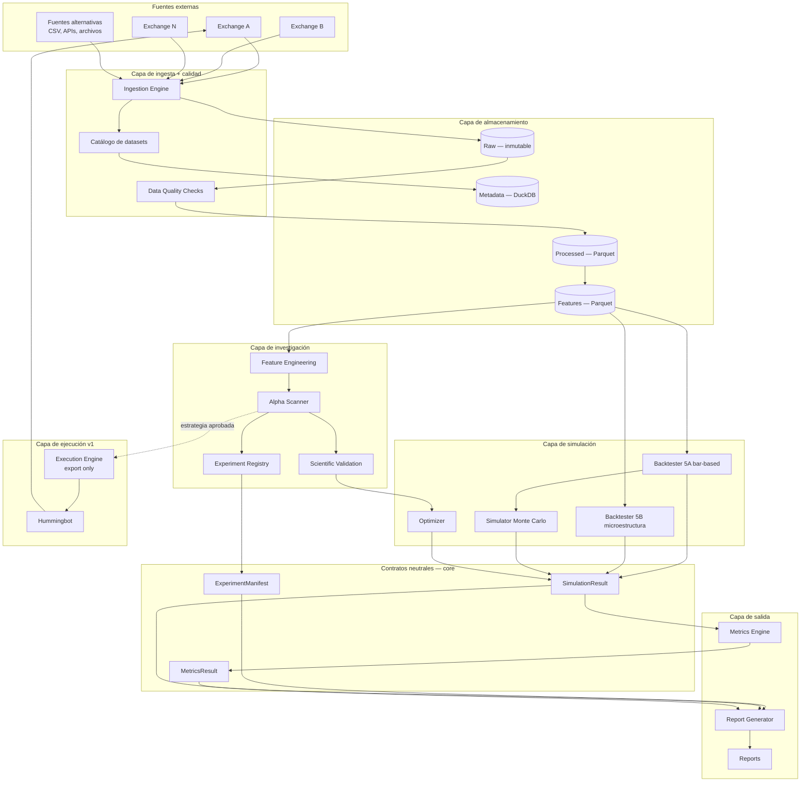
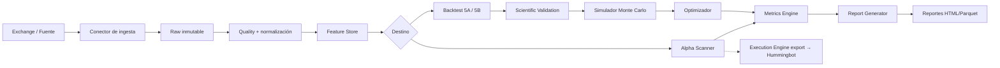
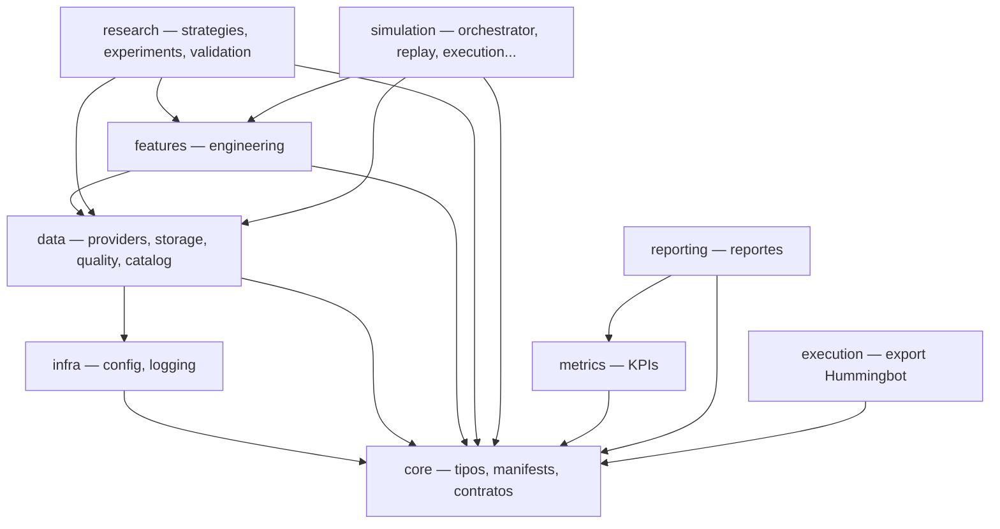
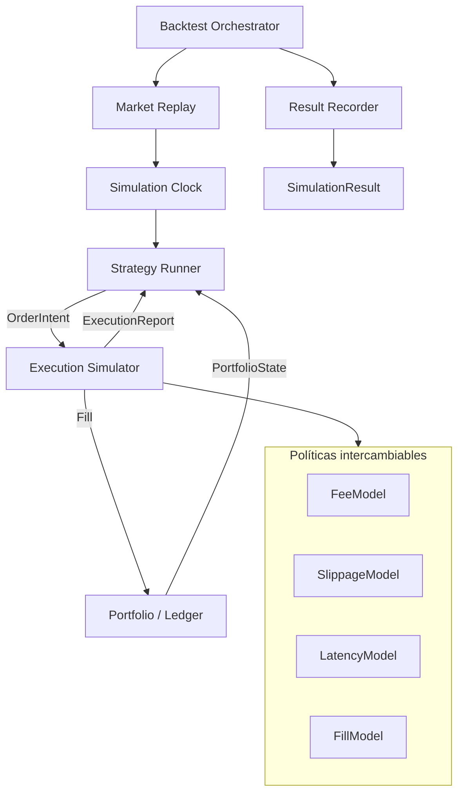
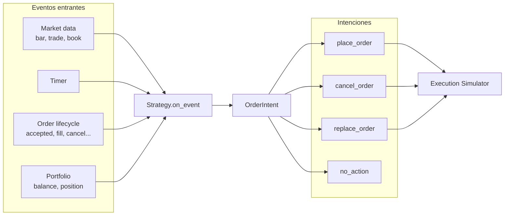
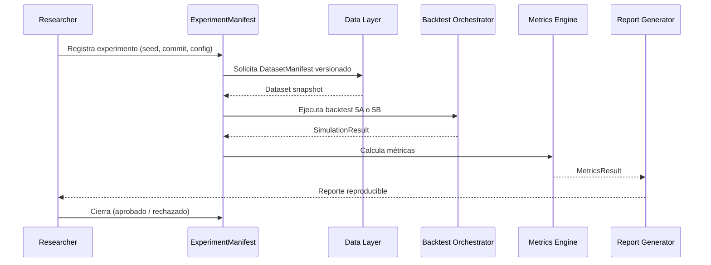
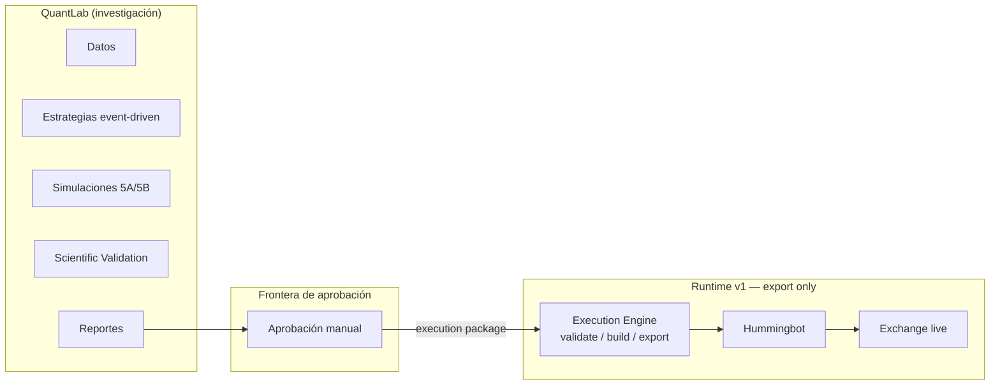
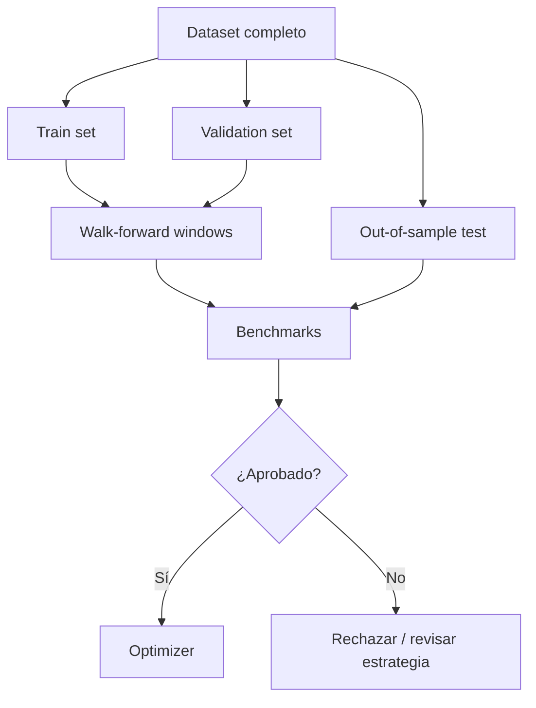
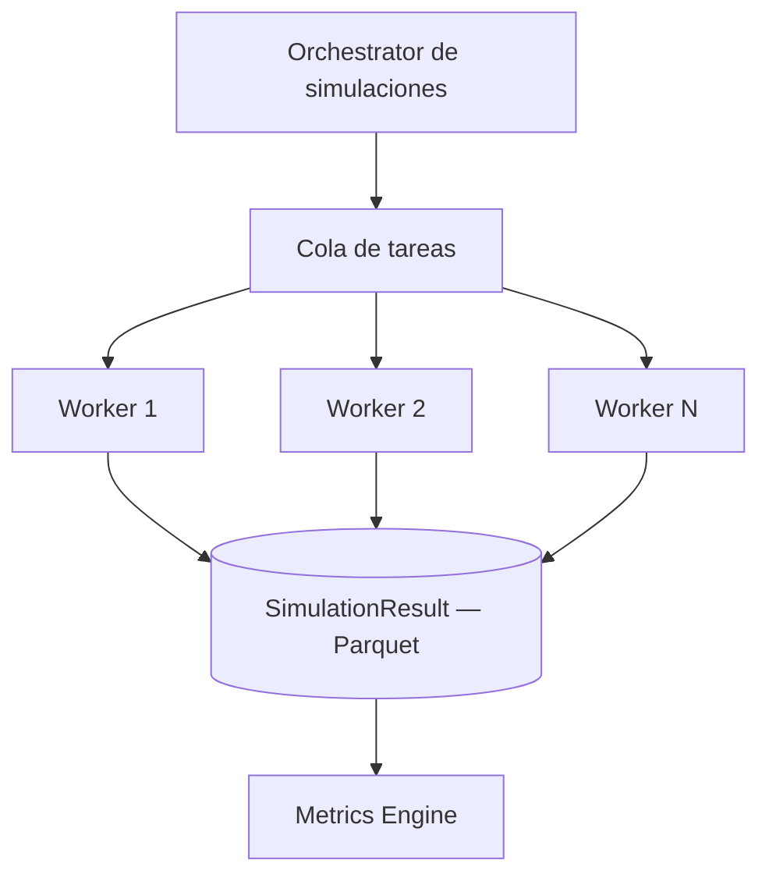

# QuantLab — Diagramas de Arquitectura

> Fase 1 — Iteración 1.1. Solo diseño. Sin implementación.

---

## 1. Vista general del sistema

---

## 2. Flujo de datos principal

---

## 3. Dependencias entre módulos

**Reglas de dependencia (v1.1):**

- `metrics` consume `SimulationResult` y produce `MetricsResult` desde `core`. **No depende de `simulation`.**
- `reporting` consume `ExperimentManifest`, `SimulationResult`, `MetricsResult` desde `core`. **No depende de `research`.**
- Ningún módulo importa implementaciones concretas de otro módulo del mismo nivel.

---

## 4. Arquitectura interna del Backtester

---

## 5. Strategy event-driven

**Nota:** `on_bar` es adaptador opcional para estrategias bar-based; el contrato universal es `on_event`.

---

## 6. Ciclo de vida de un experimento

---

## 7. Separación investigación vs ejecución

QuantLab **nunca** envía órdenes directamente. v1 solo exporta configuración validada.

---

## 8. Scientific Validation (antes de Optimizer)

---

## 9. Escalabilidad (visión futura — Fase 17)

Contratos de dominio sin cambios; solo infraestructura y orquestación evolucionan.
