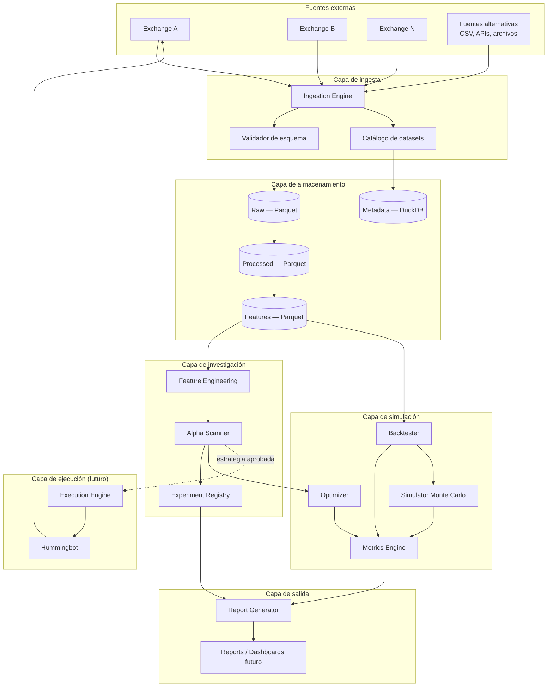
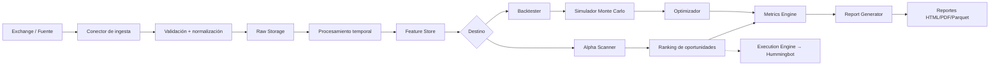
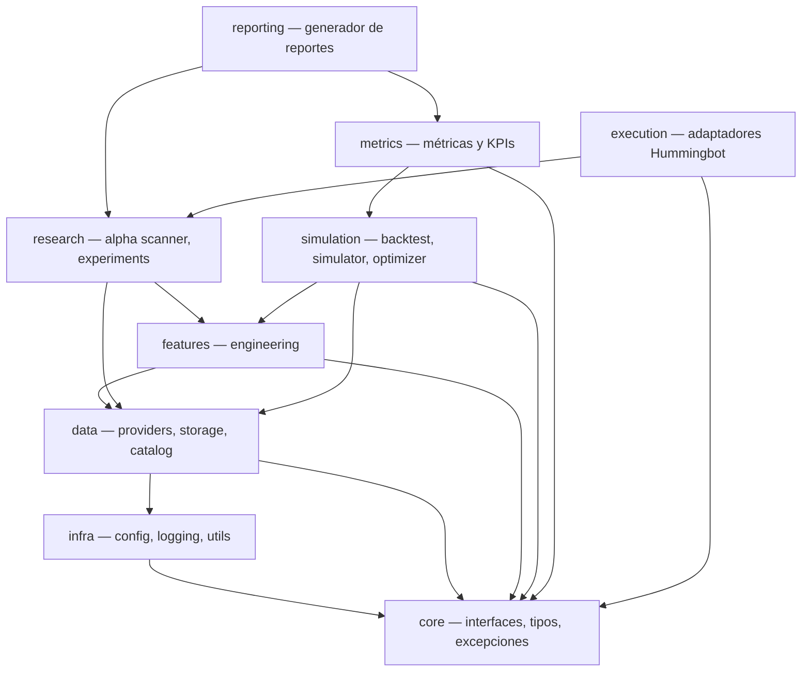
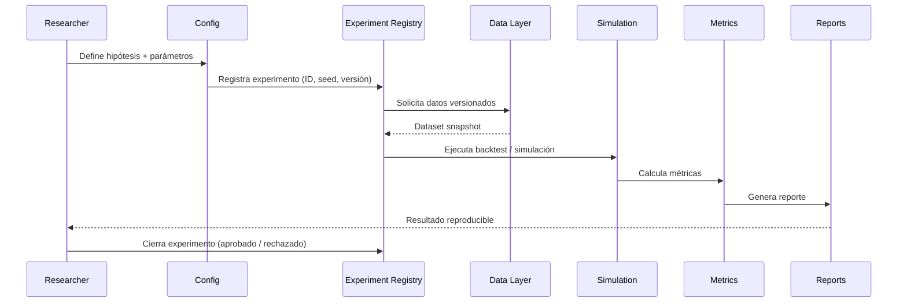
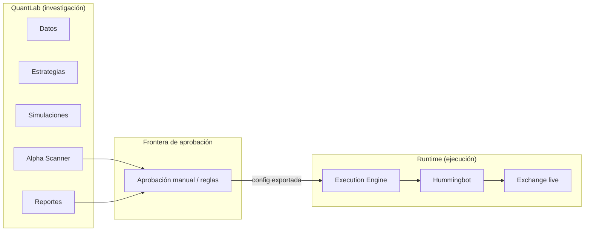
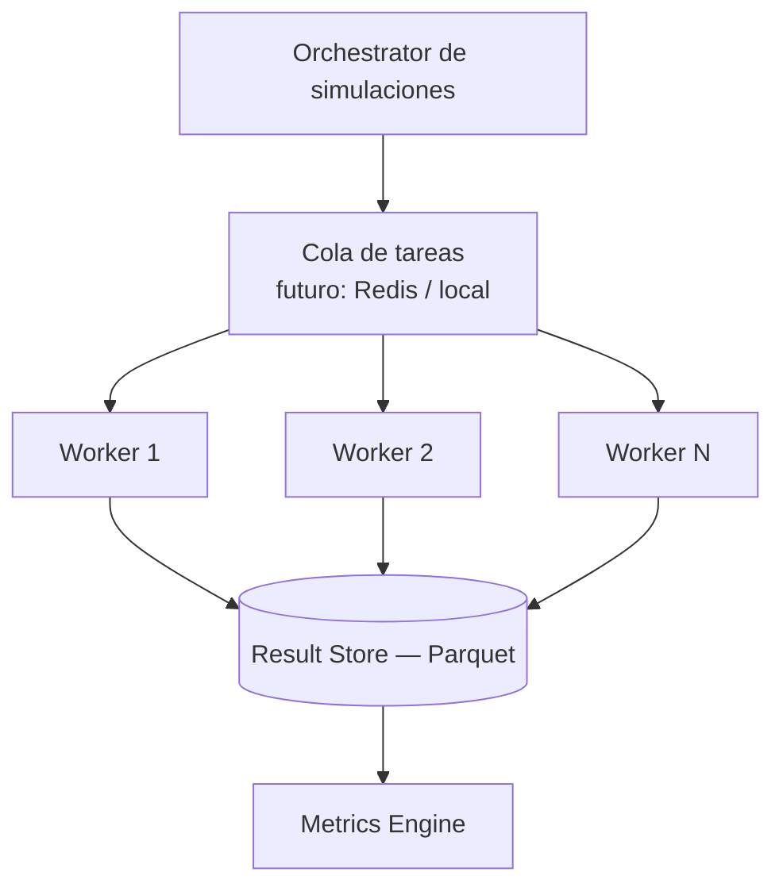

# QuantLab — Diagramas de Arquitectura

> Fase 1 — Solo diseño. Sin implementación.

---

## 1. Vista general del sistema

---

## 2. Flujo de datos principal

---

## 3. Dependencias entre módulos

**Regla:** Ningún módulo de nivel superior depende de detalles de implementación de otro módulo del mismo nivel. Toda comunicación pasa por interfaces definidas en `core`.

---

## 4. Ciclo de vida de un experimento

---

## 5. Separación investigación vs ejecución

QuantLab **nunca** envía órdenes directamente al exchange. Solo exporta configuraciones validadas hacia el Execution Engine.

---

## 6. Escalabilidad de simulaciones (visión futura)

En Fase inicial: ejecución local secuencial/paralela con `multiprocessing`.
En escalamiento: workers distribuidos sin cambiar interfaces de `Simulator` ni `Optimizer`.
