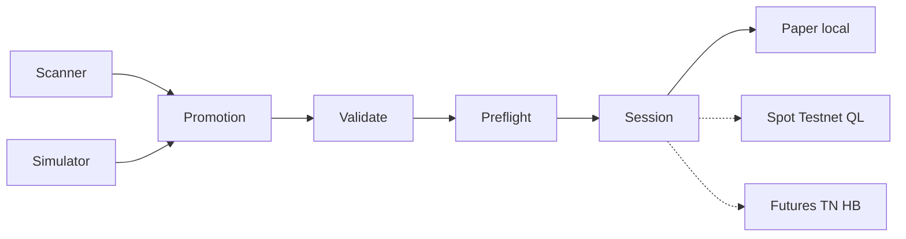

# Live test estrategia en testnet — arquitectura MVP

## Principio

QuantLab **monitorea y promueve**; la ejecución remota queda acotada por gates explícitos.
Producción siempre bloqueada (`LIVE_BLOCKED=True`).

## Capas

## Destinos

| Destino | MD | Órdenes MVP | Motor |
|---------|----|-------------|-------|
| PAPER | Binance público | Sim local | `PaperSessionRunner` |
| BINANCE_SPOT_TESTNET | Real/testnet | Preflight only | QuantLab nativo |
| BINANCE_FUTURES_TESTNET | Real/testnet | Preflight only | Hummingbot (stub) |

## Manifiesto

`StrategyPromotionManifest` incluye:

- `source_module`, `scan_id` / `simulation_id`
- `strategy_id`, parámetros, símbolo
- `execution_destination`, `market_data_source`
- `configuration_hash` (SHA-256 canonical JSON)

## Seguridad UI

Banner fijo: **MD REALES · ÓRDENES TESTNET/PAPER · FONDOS DE PRUEBA · PRODUCCIÓN BLOQUEADA**

## Corrección vs prompt original

- **Spot Testnet** no usa connector Hummingbot spot testnet; usa routing nativo QuantLab.
- **Futures Testnet** sí apunta a Hummingbot perpetual testnet (IPC/deploy futuro).
- MVP no autoriza órdenes automáticas en preflight.

## Módulos

- `src/quantlab/execution/strategy_execution/`
- `src/quantlab/workbench/execution_api.py`
- `src/quantlab/workbench/static/js/panes/strategy_live_test.js`
